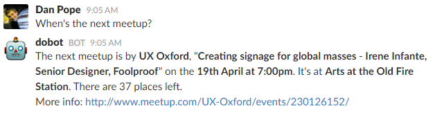
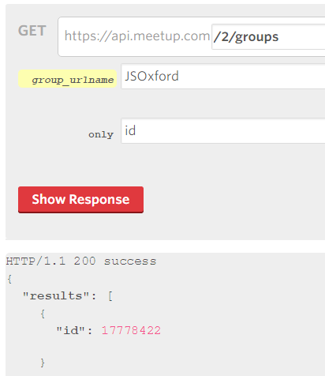

# Contributing

We welcome any ideas, issues and pull requests that you may want to submit to Dobot. Thanks for helping Digital Oxford become a more productive / entertaining / random community! :+1:

If you have any questions, [come chat with us in #robot](https://digitaloxford.slack.com/messages/robot/).

## Adding your group

One of the common things you may want to do is add your group to Dobot's Meetup integration. You can ask Dobot about the next meetup, and it will respond:



You can also add the name of the Meetup group that you want to check, e.g. "When's the next JSOxford event?" and Dobot will look for the next meetup in that group.

To add your Meetup group, add its details to [meetup-groups.json](meetup-groups.json). Let's take JS Oxford as an example.

```json
{
  "name": "JS Oxford",
  "id": "17778422",
  "aliases": ["javascript", "js"]
}
```

- `name`: The name of the meetup group.
- `id`: The Meetup group ID, which can be found using the [Meetup API console](https://secure.meetup.com/meetup_api/console/?path=/2/groups). Take the group's name from its Meetup URL and paste it into the `group_urlname` box. Set the `only` field to `id`, then the response will come back with the right ID.
- `aliases`: An array of keywords that Dobot will look out for, and associate with that group. Dobot will look for JS Oxford events when you ask "When's the next JavaScript meetup?", "When's the next JS meetup?" or "When's the next jsoxford meetup?", since 'jsoxford' contains the substring 'js', matching the second alias.


